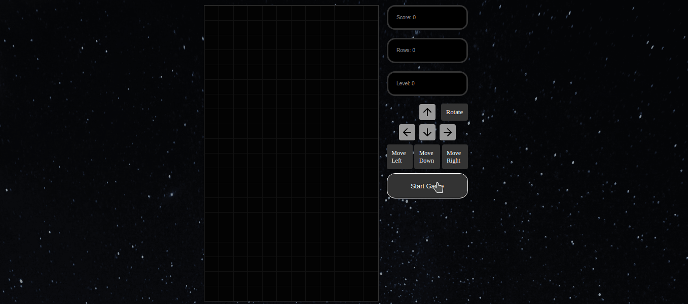

<h2 align="center">
   <h1>Tetris Game</h1>
</h2>
  
<p align="center">
  

  

  	
  <a href="https://www.linkedin.com/in/gabriel-pereira-oliveira-78b1801ab/">
    
  </a>
	
  
  <a href="https://github.com/Gabrielpdev/tetris-game/commits/master">
    
  </a>

  
   <a href="https://github.com/Gabrielpdev/tetris-game/stargazers">
    
  </a>
</p>

## 📝 Conteúdo
<p align="center">
<a href="#about">Sobre</a>&nbsp;&nbsp;&nbsp;|&nbsp;&nbsp;&nbsp;
<a href="#getting_started">Iniciando</a>&nbsp;&nbsp;&nbsp;|&nbsp;&nbsp;&nbsp;
<a href="#built_using">Tecnologias Utilizadas</a>&nbsp;&nbsp;&nbsp;|&nbsp;&nbsp;&nbsp;
<a href="#contribute">Como contribuir</a>&nbsp;&nbsp;&nbsp;|&nbsp;&nbsp;&nbsp;
</p>


## 🧐 Sobre <a name = "about"></a>

Jogo de Tetris criado com ReactJS e JavaScript de um tutorial no Youtube, [link][tutorial], caso também queira aprender a como fazer o jogo.


<span align="center">
	
</span>

## 🏁 Iniciando <a name = "getting_started"></a>

Instruções de como ter o jogo em sua maquina, caso queira testar online, clique no link a seguir :

[TESTE AGORA][link-jogo]

### ⚒ Instalando <a name = "installing"></a>

```
git clone https://github.com/Gabrielpdev/tetris-game.git

$ cd tetris-game
yarn
yarn start

```

## ⛏️ Tecnologias Utilizadas <a name = "built_using"></a>

As seguintes ferramentas foram usadas na construção do projeto:
-  [JavaScript][javascript]
- ⚛️ [React][reactjs]
- 💅 [Styled-components][styled-components]


## 🤔 Como contribuir <a name = "contribute"></a>

- Faça um fork desse repositório;
- Cria uma branch com a sua feature: `git checkout -b minha-feature`;
- Faça commit das suas alterações: `git commit -m 'feat: Minha nova feature'`;
- Faça push para a sua branch: `git push origin minha-feature`.

Feito com ❤️ por Gabriel Pereira 👋🏽 [Entre em contato!](https://www.linkedin.com/in/gabriel-pereira-oliveira-78b1801ab/)

[javascript]: https://www.javascript.com/
[reactjs]: https://reactjs.org
[styled-components]:https://styled-components.com/
[link-jogo]: 
[tutorial]: https://www.youtube.com/watch?v=ZGOaCxX8HIU

